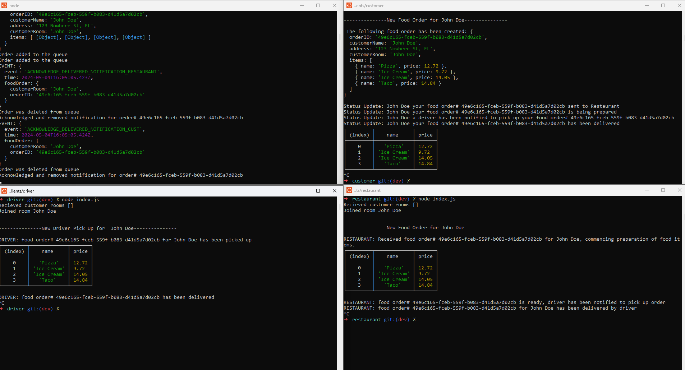

# Lab - 401 Class 14 - Restaurant Delivery Service

## Project: Restaurant Delivery Service

Build out a system that emulates a real world food delivery services. Restaurant Delivery Service will simulate a food delivery service where clients will place food order, restaurant receives and prepares order, driver is notified and picks up and delivers food. Once driver delivers food restaurant and client will be notified that their customers received food order purchase.

This will be an event driven application that “distributes” the responsibility for logging to separate modules, using only events to trigger logging based on activity.

### Author: Melo

### Problem Domain

Objective:  

1. Food Order and Delivery System:

- Hub Server: Manages orders, routing them from customers to restaurants, and then to delivery drivers.
- Clients: Customer clients can place orders; restaurant clients receive orders, mark them as ready; driver clients get notifications for pickups and deliveries. This includes using queues for order management and ensuring the correct flow of events.

### Links and Resources

- [Pull Request](https://github.com/MelodicXP/restaurant-delivery-service/pulls)
- [GitHub Actions ci/cd](https://github.com/MelodicXP/restaurant-delivery-service/actions)

### Collaborators

### Setup

#### `.env` requirements (where applicable)

NAMESPACE_URL='yourURL/rds'
CUSTOMER_INFO={"name": "FirstName LastName", "address": "123 Nowhere St, FL"}

#### How to initialize/run your application (where applicable)

- e.g. node index.js on each file, start in this order:  

        1. server
        2. restaurant
        2. driver
        3. customer

#### How to use your library (where applicable)

#### Features / Routes

- Feature One: Deploy as prod branch once all tests pass.

#### Tests

- How do you run tests?
  - jest

- Any tests of note?  
  - customer-handler.test.js
  - restaurant-handler.test.js
  - driver-handler.test.js
  - OrderCreator.test.js
  - Queue.test.js
  - FoodOrder.test.js
  - Customer.test.js

#### UML

#### File Structure

#### Terminal outputs

